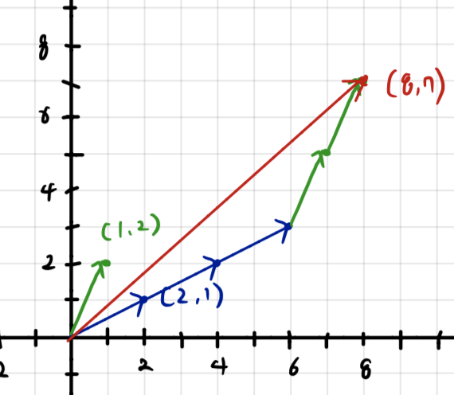

# 기저에 대한 좌표

  

<highlight>

정의 1. $$B = \{\vec{v_1}, \vec{v_2}, ..., \vec{v_k}\}$$가 $$R^n$$의 부분공간 V의 기저 집합이고

$${\vec{a}} \in V$$,  $$\vec{a} = c_1\vec{v_1}+ c_2\vec{v_2} +... + c_k\vec{v_k} $$

$$c_1, c_2, c_3, ..., c_k$$ 는 **기저 집합 B에 대한 좌표**(coordinates of $$\vec{a}$$ with respect to B)이다. 

$$[\vec{a}]_B = \begin{bmatrix} c_1 \\ c_2 \\ \vdots \\ c_k\end{bmatrix} $$

다음과 같이 표현할 수 있으며 **좌표 벡터**(coordinate vector)라고 부른다.

</highlight>

예제1) $$\vec{v_1} = \begin{bmatrix}2 \\ 1\end{bmatrix} \vec{v_2} = \begin{bmatrix}1 \\ 2\end{bmatrix}$$ 이고 $$B = \{\vec{v_1}, \vec{v_2}\}$$가 $$R^2$$의 기저이다.

$$\vec{a} = \begin{bmatrix} 8 \\ 7 \end{bmatrix}$$ 를 기저 집합 B에 대한 좌표 $$[\vec{a}]_B$$로 나타내어라.

 $$3\vec{v_1} + 2\vec{v_2} = \begin{bmatrix} 8 \\ 7 \end{bmatrix}$$

즉, $$[\vec{a}]_B = \begin{bmatrix}3 \\ 2\end{bmatrix}$$ 기저 집합 B에 대한 좌표로 표현 가능

<recap>

문제1) $$\vec{v_1} = \begin{bmatrix}2 \\ 1\end{bmatrix} \vec{v_2} = \begin{bmatrix}1 \\ 2\end{bmatrix}$$ 이고 $$B = \{\vec{v_1}, \vec{v_2}\}$$가 $$R^2$$의 기저이다.

$$\vec{a} = \begin{bmatrix} 8 \\ 7 \end{bmatrix}$$ 를 기저 집합 B에 대한 좌표 $$[\vec{a}]_B​$$로 나타내어라.

[주관식] 

</recap> 

